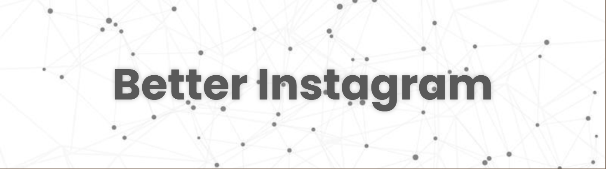

# Better Instagram

# Table of contents
- [Introduction?](#what-is-this)
- [Contributing](#contributing)
- [Installing](#installing)
- [Features](#features)

----
----

# Introduction
Instagram developpers don't make their web version good to attract people into their mobile version. This is pretty sad since this app has so much influence & potential yet is still greedy.

So I made my own prototype version of what Instagram should look like with all the potential it had.

Also, I have no life so might as well remake instagram

Right now, only the chat page is available & you can not interact with it (send messages, reply etc..) When i'll figure out sql databases. Maybe
# Contributing
Feel free to fork this repo & make changes you like. But if it's simply changing a padding to be a pixel wider. I won't accept it 😹
# Installing
👉 In your file explorer, go to a folder
> [!IMPORTANT]
> Go to a folder where you want a subfolder named "better-instagram" to get created. In my case, I have a folder named "websites" where I usually go.

👉 Ctrl + Right-click & "Open in my terminal"
> [!IMPORTANT]
> Don't forget Ctrl

👉 Copy past those two bad bois
```bash
$ git clone https://github.com/bimoware/better-instagram.git
$ cd better-instagram
$ npm i
$ npm run dev
```

👉 Instructions in your window should tell you the localhost:port to connect to to see the website.


👉 End! You're ready to contribute or just test the website & share it with your friends :D
# Features
- [x] Chat rooms
- [x] Users
- [ ] Groups
- [x] Custom context menu
- [x] Notes
    - [x] Text notes
    - [ ] Music notes
- [x] Messages
    - [x] System messages
    - [x] Text messages
        - [x] Copy 
        - [x] Copy ID
        - [ ] Reply
        - [ ] Transfer
    - [x] Voice messages
        - [ ] Mute
        - [ ] Tune
    - [x] Images
        - [ ] Download
        - [ ] Fullscreen
    - [x] Videos
        - [ ] Mute
        - [ ] Tune
        - [ ] Fullscreen
        - [ ] Download
    - [ ] Mentions
    - [ ] Link previews
- [ ] User profiles
- [ ] Top Panel on chats
- [ ] Input message
- [ ] Snapchat-like avatar peeking with profile picture
- [ ] Reactions
